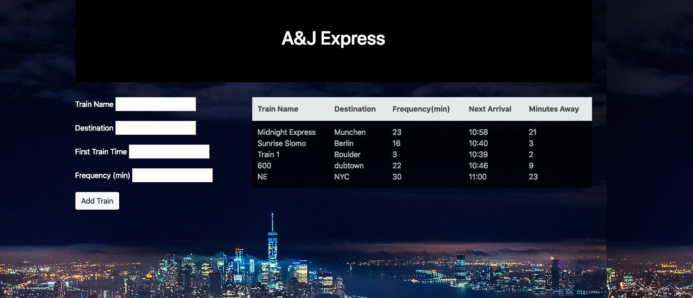

# Train-Schedule
This site is a train schedule application that incorporates Firebase to host arrival and departure data using Moment.js. This website will provide up-to-date information about various trains, namely their arrival times and how many minutes remain until they arrive at their station.

https://ashleyhart12.github.io/Train-Schedule-Homework/

**Technologies Used**
- HTML
- CSS
- Javascript
- jQuery
- Firebase
- Moment.js

Format: 
